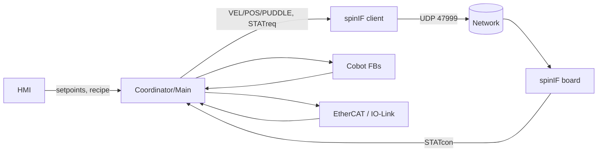
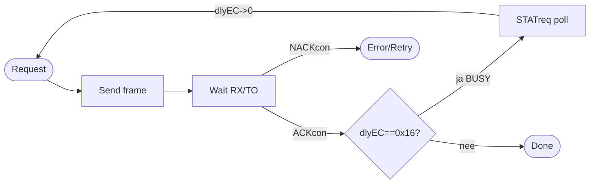
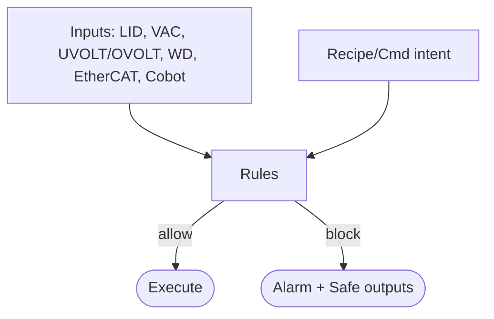

# Architectuur – EBR Automation Platform

Dit document beschrijft de **end-to-end architectuur** van het project (spinner, cobot, pneumatica, IO‑Link, interlocks, recipes en HMI).

## 1. Overzicht
- **Doelen**: reproduceerbare procesbesturing, veilige coördinatie van meerdere apparaten, traceerbaarheid, en robuuste foutafhandeling.
- **Topologie**: PLC met EtherCAT‑master; UDP naar spinIF board; Cobot via vendor‑lib (EtherCAT/fieldbus); IO‑Link sensoren via EtherCAT‑gateway; VISU op PLC/HMI.

## 2. Lagen
1. **Hardware IO & BUS** – EtherCAT‑master, IO‑Link master/slaves, netwerk UDP.
2. **Drivers / Transports** – NBS.UDP_peer/send/receive (HTTP_Client POU); cobot‑lib FB’s; IO‑Link vendor‑FB’s; EtherCAT I/O‑mapping.
3. **Protocol & Devices** – spinIF client (FB_PolosClient + Build/Parse/Decode), STATcon model, early‑ACK/BUSY, timeout/retry (v4.25). citeturn19search1
4. **Coordination / Sequencing** – centrale state machines, interlock engine, timing, watchdog, synchrone acties met cobot.
5. **Recipe Engine** – recepten (types, validatie, executor), persistente opslag, tracing.
6. **HMI/Visu** – overzicht, instellingen, recipe‑editor, alarmen, diagnose (UDP TX/RX‑log, STATcon live).

## 3. Taken en cycli
- **EtherCAT_Task** ≈ **2 ms** – Main/coordination, snelle interlocks, cobot‑calls. citeturn6file3
- **UDP/Network task** ≈ **20 ms** – `HTTP_Client` (NBS UDP), TX/RX‑buffers. citeturn6file3
- **VISU_TASK** ≈ **100 ms** – HMI updates, user‑events. citeturn6file3

## 4. Componenten
- **Spinner** (spinIF v4.25): UDP 47999, protocol header 0x98FE/vers 0x02; early‑ACK (dlyEC=0x16 BUSY); timeouts: 20 ms (default), 1 s (VEL/POS/PUDDLE/STOP/HM_*), 10 s (OFF). citeturn19search1
- **Cobot**: vendor‑FB’s; functies (Reset/MoveLcp/MoveJcp_Rel/Dragmode/ResetAllError); sequencer `stepC` in Main. citeturn6file3
- **Pneumatica**: ventielen/drukregelaars via EtherCAT/SETOUT (spinIF) en/of I/O‑modules. citeturn19search1
- **IO‑Link**: master via EtherCAT; cyclic read/ISDU; normalisatie naar engineering units.

## 5. Datastromen

## 6. Init & power‑loss
- **INITreq** → ACK (~100 ms) → device reboot (~3 s) → OS link‑recovery mogelijk tot **~10 s**; daarna PRDVAL versiecheck en parameters zetten (DeviceSize/AutoLid/GearFactor). citeturn19search1

## 7. Flowcharts (kern)

### 7.1 Early‑ACK/BUSY

### 7.2 Interlock engine (concept)

## 8. Referenties
- spinIF v4.25 manual (UDP datagram, PTYP/CMD tabellen, early‑ACK/BUSY, init‑timing). citeturn19search1
- Huidige POU’s, GVL’s en tasks in project (consolidated MD). citeturn6file3
